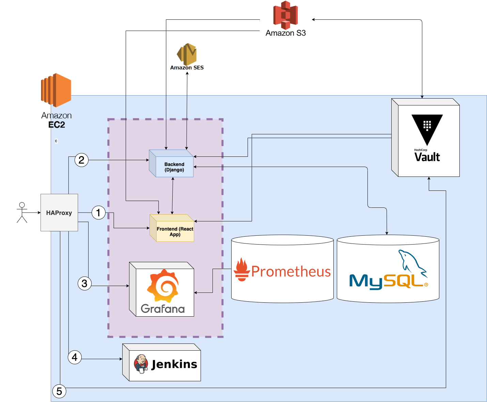

# 1interviewparjour.com

This is the repo of 1interviewparjour.com platform. The app is hosted on EC2 VM (t3.medium) for now.

## SSH Access
We allocated an ElascticIP (18.159.168.249) which point on the VW :

`ssh -i "admin-access-2.pem" ubuntu@ec2-18-159-168-249.eu-central-1.compute.amazonaws.com`

# Global architecture



## Explanation

* We use HAProxy to reverse proxy the external traffic to our services. Also, we have the possibility to load-balance the traffic quite easily since the apps in the purple area are containers which can be scaled. Here is the configuration :

```config
global
	log /dev/log	local0
	log /dev/log	local1 notice
	chroot /var/lib/haproxy
	stats socket /run/haproxy/admin.sock mode 660 level admin expose-fd listeners
	stats timeout 30s
	user haproxy
	group haproxy
	daemon

	# Default SSL material locations
	ca-base /etc/ssl/certs
	crt-base /etc/ssl/private

	# See: https://ssl-config.mozilla.org/#server=haproxy&server-version=2.0.3&config=intermediate
        ssl-default-bind-ciphers ECDHE-ECDSA-AES128-GCM-SHA256:ECDHE-RSA-AES128-GCM-SHA256:ECDHE-ECDSA-AES256-GCM-SHA384:ECDHE-RSA-AES256-GCM-SHA384:ECDHE-ECDSA-CHACHA20-POLY1305:ECDHE-RSA-CHACHA20-POLY1305:DHE-RSA-AES128-GCM-SHA256:DHE-RSA-AES256-GCM-SHA384
        ssl-default-bind-ciphersuites TLS_AES_128_GCM_SHA256:TLS_AES_256_GCM_SHA384:TLS_CHACHA20_POLY1305_SHA256
        ssl-default-bind-options ssl-min-ver TLSv1.2 no-tls-tickets
	tune.ssl.default-dh-param 2048

defaults
	log	global
	mode	http
	option	httplog
	option	dontlognull
    timeout connect 5000
    timeout client  50000
    timeout server  50000
	errorfile 400 /etc/haproxy/errors/400.http
	errorfile 403 /etc/haproxy/errors/403.http
	errorfile 408 /etc/haproxy/errors/408.http
	errorfile 500 /etc/haproxy/errors/500.http
	errorfile 502 /etc/haproxy/errors/502.http
	errorfile 503 /etc/haproxy/errors/503.http
	errorfile 504 /etc/haproxy/errors/504.http

frontend main
    bind *:80
	bind *:443 ssl crt /etc/haproxy/certs/1interviewparjour.com.pem
	redirect scheme https if !{ ssl_fc }

    default_backend landing_page

	# Test URI to see if its a letsencrypt request
    acl letsencrypt-acl path_beg /.well-known/acme-challenge/
	acl jenkins hdr_end(host) -i jenkins.1interviewparjour.com
    acl admin hdr_end(host) -i admin.1interviewparjour.com
	acl observability hdr_end(host) -i observability.1interviewparjour.com
	acl vault hdr_end(host) -i vault.1interviewparjour.com

    use_backend letsencrypt if letsencrypt-acl
	use_backend jenkins_ui if jenkins
	use_backend admin_ui if admin
	use_backend observability_ui if observability
	use_backend vault_ui if vault


#-------------------------------------------
# The LetsEncrypt backend for TLS cert
#-------------------------------------------
backend letsencrypt
	server letsencrypt 127.0.0.1:8888


#-------------------------------------------
# The React landing page application running
# in a docker network on port 8567
# (un-comment the 'check' below when it'll
# be available)
#-------------------------------------------
backend landing_page
	server react_srv 127.0.0.1:8567 check


#-------------------------------------------
# Access the jenkins dashboard for CI/CD
# pipelines on port 8080
#-------------------------------------------
backend jenkins_ui
	server jenkins_srv 127.0.0.1:8080 check


#------------------------------------------
# Access the Django Admin page for creating
# Problems and other models... available on
# port 8000 in exposed docker network.
# (un-comment the 'check' below when it'll
# be available)
#------------------------------------------
backend admin_ui
	server admin_srv 127.0.0.1:8000 check


#------------------------------------------
# Access the Observability(Grafana)
# dashboard page for monitoring metrics
#  available on port 3000 in exposed docker
# network. (un-comment the 'check' below
# when it'll be available)
#------------------------------------------
backend observability_ui
    server observability_srv 127.0.0.1:3000 check


#------------------------------------------
# Access our Vault interface for CRUD ops
# on secrets. Available on port 8200.
# (un-comment the 'check' below when it'll
# be available)
#------------------------------------------
backend vault_ui
    server vault_srv 127.0.0.1:8200/ui check
```

* As you may have guessed, this configuration allows the subdomains 1interviewparjour.com, admin.1interviewparjour.com, observability.1interviewparjour.com, jenkins.1interviewparjour.com and vault.1interviewparjour.com to be respectively  routed to 1, 2, 3, 4 and 5 (while keeping the TLS encryption) on the picture above.

## Why Prometheus+Grafana ?

I like to keep all my metrics centralized. Everything, from the containers CPU usage to the number of mails sent is persisted and plotted here.

## Why Vault ?

I like to keep all my secrets in one place. Every sensitive data is stored in Vault which is configured to use S3 as its storage engine. The data can either be accessed using `AppRole` authentication (for the apps) or with `Token/MasterKeys` (for root ops) or classical `Userpass` authentication when managing the secrets in the UI at vault.1interviewparjour.com

## Using the Hashicorp Vault API Client (HVAC)

We created a Vault `AppRole` named `1interviewparjour-app` with the following policy :
```hcl
# Enable key/value secrets engine at the secret path
path "sys/mounts/secret" {
  capabilities = ["update"]
}

# List and read key/value secrets only
path "secret/*"
{
  capabilities = [ "read", "list" ]
}
```

Then, when the apps are deploying in Jenkins, we inject the `role-id` and the `secret-id` for `1interviewparjour-app` as environment variables (these two credentials are stored in Jenkins credentials).

Then, an authenticated HVAC with the above policy can be created like that :

```python
# In settings.py (we are in a Django App)
import os

APPROLE_ID = os.environ.get("APPROLE_ID")
APPROLE_SECRET_ID = os.environ.get("APPROLE_SECRET_ID")
VAULT_ENDPOINT = os.getenv("VAULT_ENDPOINT", "http://127.0.0.1:8200")
```

```python
# Somewhere in the Django apps...
from django.conf import settings
from hvac.v1 import Client as AppRoleTokenBuilder
from hvac import Client as AppRoleClient

token = AppRoleTokenBuilder(url=settings.VAULT_ENDPOINT)
    .auth_approle(
        settings.APPROLE_ID,
        secret_id=settings.APPROLE_SECRET_ID
    )
)['auth']['client_token']

client = AppRoleClient(url=settings.VAULT_ENDPOINT, token=token)

# reading secrets using your Vault paths (i.e : 1interviewparjour/mysql)
response = client.secrets.kv.v2.read_secret_version(path='1interviewparjour/mysql')
# `content` is sth like {key_1: secret_1, ..., key_n: secret_n}
content = response["data"]["data"]
```


